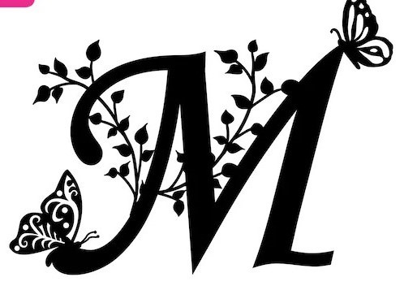

  
  <h1>Marzia Yarzada</h1>
  
I'm Marzia Yarzada, a full-stack web developer with over two years of experience in building modern and scalable web applications. I specialize in React.js, Node.js, and MongoDB, creating intuitive user interfaces and efficient back-end logic. Passionate about continuous learning, I enjoy mentoring aspiring developers and contributing to the tech community

<h2>My Experience</h2>

